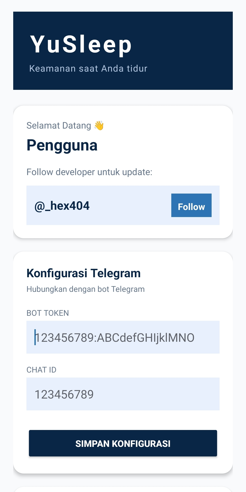
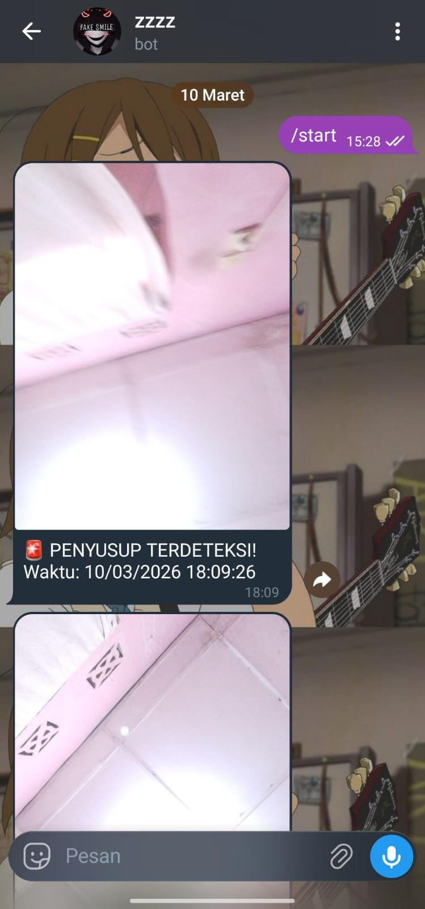

# 💤 YuSleep

## About

**YuSleep** adalah aplikasi Android sederhana untuk menjaga privasi perangkat secara otomatis.

Aplikasi ini akan langsung mengambil foto ketika ada yang membuka HP kita, lalu mengirimkannya ke akun Telegram milik pengguna.

---

## Features

* **Auto Capture**  
  Mengambil foto secara otomatis saat perangkat diakses.

* **Telegram Integration**  
  Foto langsung dikirim ke akun Telegram menggunakan bot (User ID & Token milik pengguna).

* **Background Service**  
  Berjalan di latar belakang tanpa mengganggu penggunaan perangkat.

* **Private Setup**  
  Semua konfigurasi (Telegram ID & Bot Token) diatur oleh pengguna sendiri di dalam aplikasi.

---

## How It Works

1. User memasukkan **Telegram Bot Token** dan **User ID**  
2. Aplikasi berjalan di background  
3. Saat trigger terjadi:
   * Kamera mengambil foto  
   * Foto dikirim ke Telegram user  

---

## Tech Stack

* Android (Java/Kotlin)  
* Camera API  
* Telegram Bot API  

---

## Notes

Project ini dibuat untuk kebutuhan personal dan eksperimen fitur keamanan sederhana.

---

## tampilan pas di dalam apk nya 

---

## hasilnya 

---

## 📞 Contact Developer

  
  &nbsp;&nbsp;
  

---

## ⬇️ Download

  

💤 *YuSleep — simple way to keep an eye on your device.*
